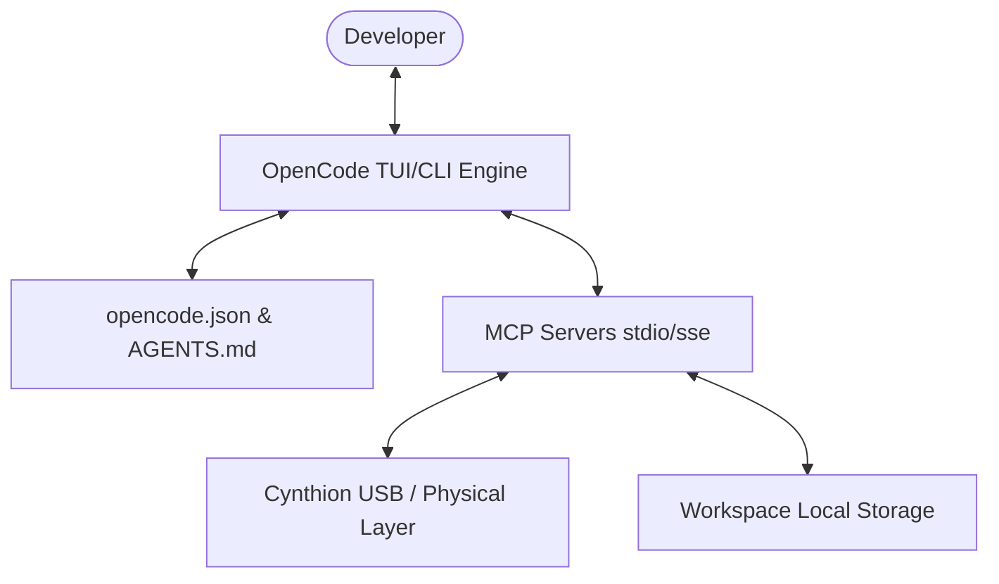

# Antigravity 2.0 Project Guidelines (`AGENTS.md`)

Welcome to **Antigravity 2.0**, powered by the **OpenCode AI Engine**. This file serves as the official specification, standard practices, and workflow configuration guidelines for all development tasks in this workspace.

---

## 1. Core Architecture Overview

Antigravity 2.0 is designed to bridge high-level agentic coding workflows with low-level systems (such as the **Cynthion USB Analysis hardware** and local automation suites). 

---

## 2. Modes of Operation & Developer Workflows

All work in Antigravity 2.0 should proceed through the standard **Plan -> Build -> Review** cycle:

### 📋 A. Plan Mode (Tab: Plan)
- **Primary Focus**: Deep architectural analysis, requirement gathering, and technical mapping.
- **Rules**:
  - Keep operations **read-only** (do not modify source files or execute dangerous commands in this stage).
  - Trace code paths and verify dependencies using AST search and grepping.
  - Formulate an `implementation_plan.md` in the artifact directory, detailing target files, exact modification chunks, and verification tests.
  - Seek explicit approval from the developer before writing code.

### 🛠️ B. Build Mode (Tab: Build)
- **Primary Focus**: Implementation, file manipulation, and direct environment deployments.
- **Rules**:
  - Write modular, clean, and highly robust code. Keep functions focused and respect existing conventions.
  - Utilize OpenCode's **real-time Diff features** to inspect incremental changes before finalizing edits.
  - Keep track of work using the `task.md` list.
  - Avoid generic styling or empty placeholder code. Always build state-of-the-art, production-ready interfaces and logic.

### 🔍 C. Review Mode (Command: `@review`)
- **Primary Focus**: Logic verification, performance profiling, security audits, and compliance validation.
- **Rules**:
  - Run the custom `@review` agent after any significant build block.
  - Validate coding standards, check for potential race conditions, inspect memory usage, and audit API bounds.

---

## 3. Technology Stack & Coding Standards

1. **Architecture Style**: Modular, domain-driven design.
2. **Languages**:
   - Web Interfaces: HTML5, CSS3, Modern JavaScript (ES6+), and React/Vite where applicable.
   - Systems & Scripts: Node.js, Python, or PowerShell scripts depending on target integrations.
3. **Styling & Aesthetics**:
   - Use curated color palettes (e.g., slate/indigo dark mode, subtle gradients, rich glassmorphism).
   - Implement premium micro-animations for interactive UI components to ensure an outstanding user experience.
4. **Hardware Integrations (MCP)**:
   - All integrations must be accessed securely via Model Context Protocol (MCP).
   - The `cynthion-usb-analyzer` MCP server must communicate via standard `stdio` transport using optimized Python interfaces.

---

## 4. MCP & Hardware Testing Standards

When interfacing with Cynthion USB or other hardware analyzers via MCP:
- Verify that standard interfaces are correctly exported via JSON-RPC.
- Never write direct raw hardware access code into standard user-facing logic; instead, delegate to MCP tools.
- Set precise permissions in `opencode.json` (`run_command` and `write_file` should remain `ask` for security).

---

*Keep this document updated as new system layers are added.*
